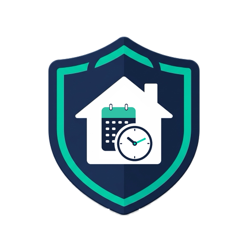

# 
 🗓️ DomoLink-Planification

**DomoLink-Planification** est une intégration Home Assistant haut de gamme conçue pour orchestrer des déclenchements temporels avancés, des déclencheurs de présence géolocalisée (zones), des planifications récurrentes contextuelles, et une **gestion bioclimatique solaire ultra-précise des volets roulants**.

---

## 🌟 Fonctionnalités Principales

### 1. ☀️ Gestion Bioclimatique Solaire des Volets Roulants
* **Orientation par boussole 16 secteurs** (Nord, Nord-Est, Est, Sud-Est, Sud, Sud-Ouest, Ouest, etc. ou azimut précis de 0° à 359°).
* **Suivi astronomique en temps réel** : Calcul de l'angle d'incidence du soleil sur la vitre d'après l'azimut et l'élévation solaires (`sun.sun`).
* **Confort d'été (Protection Anti-Surchauffe)** :
  * Si la température dépasse le seuil défini (ex: > 24°C) **ET** que le soleil frappe directement la baie vitrée ➔ Le volet se ferme automatiquement à la position d'ombrage configurée (ex: 20%).
  * Dès que le soleil tourne et quitte la façade ➔ Le volet se rouvre automatiquement (ex: 100%) pour faire entrer la lumière naturelle.
* **Hystérésis & Anti-battement** : Temporisation intelligente pour éviter l'usure mécanique des moteurs lors d'éclaircies intermittentes.
* **Autocomplétion intelligente** : Sélecteurs filtrés avec recherche en direct pour les volets (`cover.*`) et capteurs de température (`sensor.*`).

---

### 2. 📍 Déclencheurs de Présence & Zones Géographiques
* **Arrivée dans une zone** (`zone_enter`) : Déclenchement instantané à l'entrée dans une zone.
* **Sortie d'une zone** (`zone_leave`) : Déclenchement instantané lors du départ d'une zone.
* **Filtre par personne** : Ciblage d'une personne spécifique (`person.*`, `device_tracker.*`) ou de toute personne indistinctement.
* **Combinaison temporelle** : Possibilité d'associer un déclencheur de zone à des jours spécifiques de la semaine ou des plages calendaires.

---

### 3. 🔁 Fréquences Flexibles & Dates Précises
* **🔁 Tous les** : Répétition hebdomadaire aux jours choisis.
* **⏩ Prochain** : Exécution unique lors du prochain jour sélectionné, avec option de désactivation ou suppression post-exécution.
* **📅 Date** : Sélection du mois et de l'année (ou répétition annuelle), avec sous-modes au choix :
  * *Jour précis (1 à 31)*
  * *Jours de la semaine dans le mois*

---

### 4. 🏷️ Cibles Universelles, Étiquettes & Rappels Multi-Canaux
* **Étiquettes (Labels HA)**, entités directes, pièces (Areas), scripts, automatisations et scènes.
* **Rappels & Notifications Multi-Canaux** : Envoi de messages personnalisés vers Free Mobile SMS, Telegram, l'application officielle Home Assistant ou notifications persistantes.

---

### 5. 🌍 Calendriers & Jours Fériés Multi-Pays (100% Offline)
Moteur autonome (sans API tierce) pour :
* 🇫🇷 **France (FR)**, 🇺🇸 **États-Unis (US)**, 🇬🇧 **Royaume-Uni (GB)**, 🇮🇹 **Italie (IT)**, 🇪🇸 **Espagne (ES)**, 🇩🇪 **Allemagne (DE)**, 🇺🇦 **Ukraine (UA)**.
* Options : *Actif tous les jours*, *Exclure jours fériés*, *Comportement Week-end*, *Uniquement jours fériés*.

---

### 6. 🎛️ Panneau Latéral Glassmorphism & Badge Bleu France
* **Badge Bleu France** (`#002395`) avec texte blanc contrasté dans le menu latéral gauche de Home Assistant.
* **Bouton « Créer carte Lovelace »** en 1-clic copiant le code YAML de la carte personnalisée `domolink-planification-card`.

---

## 🚀 Installation

### Via HACS (Recommandé)
1. Ouvrez HACS ➔ **Intégrations** ➔ Cliquez sur les trois petits points en haut à droite ➔ **Dépôts personnalisés**.
2. Ajoutez l'URL : `https://github.com/SocrateMobile/DomoLink-Planification`
3. Catégorie : **Intégration**.
4. Cliquez sur **Télécharger**, puis redémarrez Home Assistant.
5. Allez dans **Paramètres ➔ Appareils et services ➔ Ajouter une intégration ➔ DomoLink-Planification**.

---

## 🛠️ Services Exposés

| Service | Description | Paramètres |
| :--- | :--- | :--- |
| `domolink_planification.trigger_schedule` | Déclenche immédiatement une planification | `schedule_id` (obligatoire) |
| `domolink_planification.refresh_solar_shading` | Force la réévaluation de tous les volets solaires | Aucun |
| `domolink_planification.set_schedule_enabled` | Active ou suspend une règle | `schedule_id`, `enabled` (bool) |

---

## 📄 Licence
Ce projet est sous licence MIT. Développé par **SocrateMobile** & **Jean-Frédéric Lavigne**.
